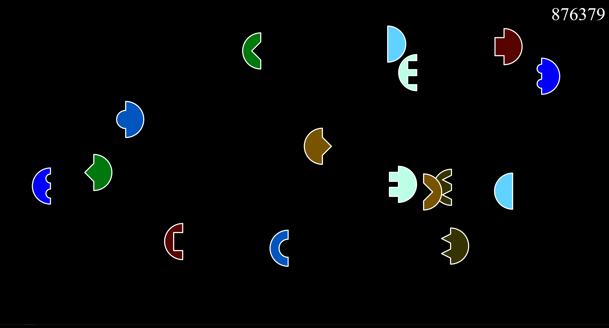

This is my entry for Ludum Dare 48.

Squiddie wants to go as far down into the Labyrinth as they can.

Light will reduce with each step. Collect torches to replenish light. When you run out of light, the game ends. Move quickly for a high score.

This game is fully implemented using html5 + javascript. Any modern browser should be able to run it, but I only tested in Google Chrome.

[Rate here](https://ldjam.com/events/ludum-dare/48/squiddies-decent)

## Controls

WASD/Arrows to move.

Space to start the game.TODO

## Library/Engine
- [Playground.js by rezoner](https://github.com/rezoner/playground) (no longer maintained, docs offline)

## Tools
- [Visual Studio Code by Microsoft](https://code.visualstudio.com/)
- [Pyxel Edit by Daniel Kvarfordt](https://pyxeledit.com/)
- [Google Chrome](https://www.google.com/intl/de_de/chrome/)